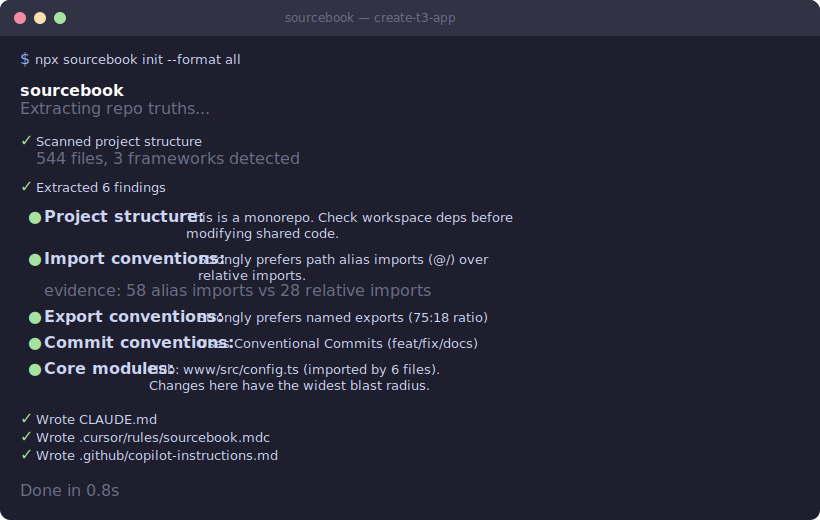

<p align="center">
  
</p>

# sourcebook

**AI can read your code. It still doesn't know how your project works.**

sourcebook captures the project knowledge your team carries in its head — conventions, patterns, traps, and where things actually go — and turns it into context your coding agent can use.

```bash
npx sourcebook init
```

<p align="center">
  
</p>

> Tools like Repomix give AI your entire codebase. sourcebook gives it your project knowledge.

## Why

AI coding agents spend most of their context window orienting — reading files to build a mental model before doing real work. Most context files (`CLAUDE.md`, `.cursorrules`) are generic and go stale fast.

Research shows auto-generated context that restates obvious information actually makes agents [worse by 2-3%](https://arxiv.org/abs/2502.09601). The only context that helps is **non-discoverable information** — the project knowledge agents can't figure out by reading code alone.

sourcebook extracts only what agents keep missing: the conventions, hidden dependencies, fragile areas, and dominant patterns that live in your team's heads — not in the code.

## What It Finds

- **Import graph + PageRank** — ranks files by structural importance, identifies hub files with the widest blast radius
- **Git history forensics** — reverted commits ("don't do this" signals), co-change coupling (invisible dependencies), rapid re-edits (code that was hard to get right), anti-patterns from abandoned approaches
- **Convention detection** — naming patterns, export style, import organization, barrel exports, path aliases, type hint usage, error handling style
- **Framework detection** — Next.js, Expo, Supabase, Tailwind, Express, TypeScript, Django, FastAPI, Flask, Go (Gin, Echo, Fiber)
- **Context-rot-aware formatting** — critical constraints at the top, reference info in the middle, action prompts at the bottom (optimized for LLM attention patterns)
- **Smart budget enforcement** — when context exceeds your token budget, drops low-priority sections first (keeps critical constraints always)

## Quick Start

```bash
# Generate CLAUDE.md for your project
npx sourcebook init

# Generate for a specific tool
npx sourcebook init --format claude    # CLAUDE.md (default)
npx sourcebook init --format cursor    # .cursor/rules/sourcebook.mdc + .cursorrules
npx sourcebook init --format copilot   # .github/copilot-instructions.md
npx sourcebook init --format all       # All of the above

# Re-analyze while preserving your manual edits
npx sourcebook update

# See what changed since last generation (exit code 1 = changes found)
npx sourcebook diff

# Limit output to a token budget (drops low-priority sections first)
npx sourcebook init --budget 1000
```

## Commands

| Command | What it does |
|---------|-------------|
| `sourcebook init` | Analyze codebase and generate context files |
| `sourcebook update` | Re-analyze while preserving sections you added manually |
| `sourcebook diff` | Show what would change without writing files (exit code 1 if changes found — useful for CI) |
| `sourcebook serve` | Start an MCP server exposing live codebase intelligence (Pro) |

### Options

| Flag | Description | Default |
|------|-------------|---------|
| `-d, --dir <path>` | Target directory | `.` |
| `-f, --format <formats>` | Output formats: `claude`, `cursor`, `copilot`, `all` | `claude` |
| `--budget <tokens>` | Max token budget for output | `4000` |
| `--dry-run` | Preview findings without writing files | — |

## Language Support

| Language | Framework Detection | Convention Detection | Import Graph | Git Analysis |
|----------|:------------------:|:-------------------:|:------------:|:------------:|
| TypeScript/JavaScript | Next.js, Expo, Vite, React, Express, Tailwind, Supabase | Barrel exports, path aliases, export style, error handling | Full | Full |
| Python | Django, FastAPI, Flask, pytest | Type hints, `__init__.py` barrels | Full | Full |
| Go | Gin, Echo, Fiber | Module path, cmd/pkg/internal layout, error wrapping, interfaces | Full | Full |

## GitHub Action

Auto-update context files on every merge:

```yaml
# .github/workflows/sourcebook.yml
name: Update context files
on:
  push:
    branches: [main]

jobs:
  sourcebook:
    runs-on: ubuntu-latest
    steps:
      - uses: actions/checkout@v4
      - uses: maroondlabs/sourcebook@main
        with:
          format: all
```

## Example Output

Running on [cal.com](https://github.com/calcom/cal.com) (10,456 files):

```
sourcebook
Extracting repo truths...

✓ Scanned project structure
  10,456 files, 3 frameworks detected
✓ Extracted 11 findings

  ● Core modules: types.ts imported by 183 files — widest blast radius
  ● Circular deps: bookingScenario.ts ↔ getMockRequestData.ts
  ● Co-change: auth/provider.ts ↔ middleware/session.ts (88% correlation)
  ● Dead code: 1,907 orphan files detected
  ● Conventions: named exports preferred (26:2 ratio)
  ● Barrel exports: 40 index.ts re-export files
  ● Commit style: Conventional Commits (feat/fix/docs)

✓ Wrote CLAUDE.md
✓ Wrote .cursor/rules/sourcebook.mdc
✓ Wrote .github/copilot-instructions.md

Done in 3.1s
```

## How It Works

sourcebook runs five analysis passes, all deterministic and local — no LLM, no API keys, no network calls:

1. **Static analysis** — framework detection, build commands, project structure, environment variables
2. **Import graph** — builds a directed graph of all imports, runs PageRank to find the most structurally important files
3. **Git forensics** — mines commit history for reverts, anti-patterns, co-change coupling, churn hotspots, and abandoned approaches
4. **Convention inference** — samples source files to detect naming, import, export, error handling, and type annotation patterns
5. **Budget enforcement** — if output exceeds your token budget, intelligently drops low-priority sections (supplementary findings first, critical constraints never)

Then applies a **discoverability filter**: for every finding, asks "can an agent figure this out by reading the code?" If yes, drops it. Only non-discoverable information makes it to the output.

Output is formatted for **context-rot resistance** — critical constraints go at the top and bottom of the file (where LLMs pay the most attention), lightweight reference info goes in the middle.

## MCP Server

> **Pro feature** — requires a sourcebook Pro license.

`sourcebook serve` starts a local MCP (Model Context Protocol) server that exposes live codebase intelligence to any MCP-compatible AI client — Claude Code, Claude Desktop, Cursor, and others.

Instead of a static context file, your AI agent can query your project's architecture on demand: look up blast radius before editing, check conventions before writing code, mine git history for anti-patterns.

### Installation

Add sourcebook to your MCP client config:

```json
{
  "mcpServers": {
    "sourcebook": {
      "command": "npx",
      "args": ["-y", "sourcebook", "serve", "--dir", "/path/to/your/project"]
    }
  }
}
```

**Claude Code** — run in your terminal:

```bash
claude mcp add sourcebook -- npx -y sourcebook serve --dir /path/to/your/project
```

Or add manually to `~/.claude/claude_desktop_config.json`.

**Claude Desktop** — add to `~/Library/Application Support/Claude/claude_desktop_config.json`.

**Cursor** — add to `.cursor/mcp.json` in your project or `~/.cursor/mcp.json` globally.

**Other MCP clients** — any client that supports STDIO transport works with the same config block above.

Restart your client after updating the config.

### Available Tools

| Tool | What it does |
|------|-------------|
| `analyze_codebase` | Full analysis: languages, frameworks, findings, top files by PageRank importance |
| `get_file_context` | File-level context: importance score, hub status, co-change partners, applicable conventions |
| `get_blast_radius` | Risk assessment for editing a file: dependents, co-change coupling, fragility, circular deps |
| `query_conventions` | All detected project conventions: import style, error handling, naming, commit format |
| `get_import_graph` | Dependency architecture: hub files, circular deps, dead code, PageRank rankings |
| `get_git_insights` | Git history mining: fragile files, reverted commits, anti-patterns, active dev areas |
| `get_pressing_questions` | Pre-edit briefing: everything important to know before touching a specific file |
| `search_codebase_context` | Keyword search across all findings, conventions, structure, and frameworks |

The server caches the scan in memory — subsequent tool calls are fast. Pass `refresh: true` to `analyze_codebase` to force a re-scan.

## Roadmap

- [x] `.cursor/rules/sourcebook.mdc` + legacy `.cursorrules` output
- [x] `.github/copilot-instructions.md` output
- [x] `sourcebook update` — re-analyze while preserving manual edits
- [x] `sourcebook diff` — show what changed (CI-friendly exit codes)
- [x] `--budget <tokens>` — smart PageRank-based prioritization
- [x] Anti-pattern detection from reverted commits and deleted files
- [x] Python support (Django, FastAPI, Flask, pytest)
- [x] Go support (Gin, Echo, Fiber, module layout)
- [x] GitHub Action for CI
- [x] `sourcebook serve` — MCP server mode
- [ ] Framework knowledge packs (community-contributed)
- [ ] Tree-sitter AST parsing for deeper convention detection
- [ ] Hosted dashboard with context quality scores

## Research Foundation

Built on findings from:
- [ETH Zurich AGENTS.md study](https://arxiv.org/abs/2502.09601) — auto-generated obvious context hurts agent performance
- [Karpathy's autoresearch](https://github.com/karpathy/autoresearch) — curated context (`program.md`) is the #1 lever for agent effectiveness
- [Aider's repo-map](https://aider.chat/docs/repomap.html) — PageRank on import graphs for structural importance
- Chroma's context-rot research — LLMs show 30%+ accuracy drops for middle-of-context information

## License

BSL-1.1 — source-available, free to use, cannot be offered as a hosted service. Converts to MIT on 2030-03-25. See [LICENSE](./LICENSE) for details.
